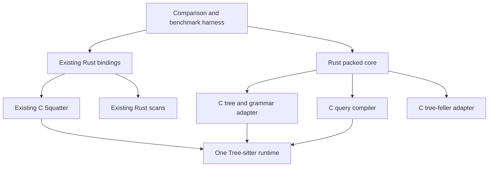

# Rust core

Proposal based on `main` at `0c3f79ab5`, which merges `iteration` through
`8810c4828`. No Rust-core implementation changes have been made.

[rust-core-interfaces.md](rust-core-interfaces.md) specifies the planned private
interfaces and ownership contracts. Preserve the existing public Rust API.

Move packed storage, packing, traversal, and query execution into Rust. Keep
Tree-sitter's private tree/grammar access, tree-feller, and query compilation in
C behind explicit interfaces. Preserve the existing implementation for direct
correctness and performance comparison. Switching the default implementation
depends on those comparisons passing.

This is independent of extracting Squatter from the Tree-sitter repository. A
separate C-backed crate already works; a Rust port is justified by ownership,
maintainability, and optimization opportunities, not by a linking requirement.

## Findings

Current implementation size, including comments and blank lines:

| Responsibility | Sources under `lib/squat` | Lines |
|---|---|---:|
| Storage, validation, presence index | `slab.c`, `index.c` | 1,061 |
| Nodes, traversal, scan bridge/kernels | `node.c`, `cursor.c`, `scan.c` | 1,178 |
| Packing and direct-parser integration | `pack.c`, `parser.c` | 1,506 |
| Grammar analysis | `symbols.c`, `supertypes.c` | 791 |
| Query compilation and execution | `query.c`, `query_plan.c` | 6,590 |
| Internal headers | top-level `*.h` | 589 |

Typed scans already live in [scan.rs](crates/squatter/src/scan.rs) (2,513 lines).
The reference is therefore a C core with Rust bindings and Rust scan execution,
not an entirely C implementation. The port should adapt those scans to Rust-owned
storage rather than reimplement them.

The boundaries do not follow the current files:

- [pack.c](lib/squat/pack.c) combines private `Subtree` traversal, grammar
  preparation, packing scratch, group formation, and encoding. Its two input
  paths already share `emit_values`, grouping, and finalization.
- [parser.c](lib/squat/parser.c) drives tree-feller into an indexed reduction
  arena, then calls the packer. [SQReduction](lib/squat/reductions.h) carries
  aliases, fields, visibility, and topology, but lacks missing/error information
  needed for mainline trees. It is not a complete common input format.
- [query.c](lib/squat/query.c) mixes compilation, grammar analysis, capture
  storage, and execution. [query_plan.c](lib/squat/query_plan.c) mixes preparation
  and execution as an included implementation file. Exporting `SQQuery` as-is
  would expose C arrays, bitfields, allocator conventions, and executor state.
- Packed reads still use `TSLanguage` fields and internal metadata helpers.
  They need a prepared metadata view before Rust can avoid private C layouts.
- Owned trees currently colocate the runtime descriptor and aligned slab in one
  allocation. Copied loading avoids zeroing the payload before overwriting it.
  These are performance properties to retain.

The earlier standalone-package probe passed eight Rust binding tests against
published `tree-sitter = "=0.27.0"` on native Linux. It established packaging and
static linkage, not performance or general version/platform compatibility.
The current C archive references seven non-public Tree-sitter symbols: four
allocator pointers and three language helpers. Rust does not remove the private
ABI dependency while the native adapter still reads `Subtree` and grammar tables.

## Structure and comparison

At implementation start, refresh to the latest `main` and record its revision.
Freeze `crates/squatter` and `lib/squat` at that baseline as the C-backed reference,
including the Rust scans, build, and tests. Introduce
`crates/squatter-rust` (`tree-squatter-rust`) for the candidate. Both depend on the
same resolved `tree-sitter` crate. The candidate must not depend on the reference
crate to reuse its public traits, scans, or wrappers.

Put the new C adapter and its private header under the candidate crate's
`native/` directory. Retain grammar-analysis code and extract the query compiler
there; the original compiler remains in the reference. Temporary duplication is
intentional so refactoring cannot silently change both sides of a comparison.
Record the source revision and port deliberate fixes explicitly to both sides.

All candidate native symbols use a separate `sq_native_` namespace. This includes
reused grammar helpers and the candidate's tree-feller entry points; renaming
only public `sq_*` functions would still leave duplicate `tf_*` definitions.
Compile-time renaming can leave vendored tree-feller sources unchanged. Check the
global symbol lists in the paired build. Never compile a second Tree-sitter
runtime into the candidate.

The candidate exposes a Rust API; a public C facade is deferred. It does not
export public `sq_*` C symbols, so the reference owns those names in paired
benchmarks. Rust callers invoke the Rust implementation directly. The adapter
never calls public `sq_*` functions, owns a packed tree, or executes a packed
query. There is no crate dependency cycle.

Keep native interop in one internal Rust module. Use a few substantial modules
for storage/packing, traversal/scans, and query execution; do not reproduce one
module per C helper. Preserve the current typed scanning
API and adapt its internals; experiment with reusing those kernels in other
operations. The old C and Rust node iterator APIs were removed before this
baseline. Further public API changes and the proposed `TreePacker` rename are
separate work.

## Grammar boundary

C retains knowledge of language layouts, alias productions, inherited fields,
and supertype analysis. A prepared native handle owns its language reference,
grammar-specific traversal tables, and lazily prepared tree-feller tables.

Expose an immutable view of the facts Rust needs: symbol and field counts,
public-symbol mapping, symbol metadata and names, field names, symbol-code
dictionaries, supertype symbols, and supertype dictionary masks. These are
Squatter-owned interface types, not a mirror of `TSLanguage` or `SQGrammar`.

Use explicit integer fields and pointer/count pairs, with integer flag masks in
place of C bitfields. A Rust owner retains the native handle for the lifetime of
all borrowed views. Cache pointer/count descriptors beside the owner and expose
slices borrowing it. Accessors and query loops
read the prepared tables directly without a C call per symbol. Copying metadata
into Rust-owned buffers is an alternative to measure if it simplifies ownership;
do not retain two persistent copies without accounting for the cost.

Rust `Grammar` shares this owner. Trees retain their grammar and continue to
outlive parsers and packers. Native grammar libraries must remain loaded. Keep
the existing retry-after-failure and concurrent-publication behavior of lazy
tree-feller preparation; an unsuccessful attempt must not permanently cache an
error. This handle, including its destructor and immutable views, needs a
specific `Send`/`Sync` audit.

## Mainline tree import and packing

Use a resumable C traversal that fills a caller-provided batch of plain events.
Its handle borrows the original `TSTree`; a Rust guard enforces that lifetime.
The adapter resolves hidden wrappers, aliases, inherited fields, extras, and
exact supertype membership. It emits visible topology only.

The exact event protocol remains an implementation-time question. A starting
point is three operations:

| Event | Meaning |
|---|---|
| Enter | Begin a visible node before traversing its children |
| Leaf | Emit a visible node with no visible children |
| Leave | Finish the most recent unmatched Enter |

Node records carry byte and optional point coordinates, display and grammar IDs,
field ID, last-visible-child status, extra/missing/subtree-error flags, and the
prepared supertype code. A code is a direct mask for small supertype sets or an
index into the prepared dictionary. Hidden-node effects must be fully represented
before they are omitted. No raw subtree pointer crosses into Rust.

Visit children from last to first and emit their parent on Leave. This preserves
the current reverse-preorder encoding. On Enter, Rust saves its current physical
write boundary. On Leave, the difference from that boundary includes any waste
introduced while encoding descendants. A node count alone cannot supply this
span. Rust owns group-fit decisions, bases, optional columns, growth, final
compaction, and presence-index construction.

The traversal retains state across batch boundaries, which may occur at any
depth. Scratch remains proportional to traversal depth, sibling-position scratch,
and a bounded batch; do not create a full expanded copy of a mainline tree.
Point-free packing continues to skip point work. A failed traversal or encoding
discards the incomplete slab and leaves reusable contexts resettable.

The fill function reports initialized event count and a distinct completion or
error status. Only the initialized prefix is readable. Records belong to the
caller; no adapter pointer may survive a refill. Resolve attribute placement on
Enter versus Leave, batch size, Leaf handling, initial node-count estimates, and
division of traversal scratch while implementing the packer. Compare allocation,
peak scratch, and packing time before fixing the interface; these are not
prerequisites for starting implementation. A batch callback is a fallback if
pull-state overhead is measurable; neither design requires callbacks for
individual attributes.

## Direct parsing

Keep tree-feller's parser and reduction sink in C. Parsing returns a native-owned
reduction view, then a native walker exposes the same visible event protocol.
Rust consumes those events with the same encoder as mainline input. The native
parser retains its arena between calls, but no completed Rust tree borrows it.
Its reduction traversal retains the current field and supertype propagation.

This path already buffers reductions proportional to the raw parse. Do not add
a second complete Rust record arena or claim the batching design eliminates the
existing scratch. Move the current `sq_pack_reductions` traversal responsibilities
to the adapter and its encoding responsibilities to Rust. Parsing no longer
calls the packed-tree API from C.

Preserve the existing eligibility rules: ABI 15, no external scanners or
nonterminal extras, syntax errors reported, and no automatic recovery fallback.
Both implementations must agree on supported inputs, syntax failures, and
successful output. Allocation-failure behavior need not match. Warm comparisons
reuse prepared tables and scratch equally.

## Query compilation boundary

Keep S-expression parsing and grammar analysis in the C compiler, retaining its
internal structures where practical and minimizing changes to the upstream-shaped
code. Use a Rust owning wrapper around an opaque native compilation result.
Its `Drop` calls the native destructor. C allocates the compiled data; Rust
controls its lifetime and reads it directly during execution. There is no
mandatory copy into Rust-owned buffers or early destruction of the native result.

Expose pointer/count views of the arrays and strings Rust needs. The owner keeps
their allocations and language alive; borrowed slices cannot outlive it. Cache
view descriptors and access them directly in Rust, without per-step C calls.
Keep raw pointers private and expose borrows tied to the wrapper, rather than
fabricating static lifetimes. Do not adopt C allocations with `Vec::from_raw_parts`;
the native destructor remains responsible for freeing them. Release compiler-only
scratch before returning the result and account for retained array capacity.

The compiled query contains:

- Steps with symbols, supertypes, fields, capture IDs, depth, alternatives,
  negated-field references, and analyzed guarantee/anchor/quantifier flags.
- Pattern entries, step ranges, rooted/non-local information, source offsets,
  and grammar-derived rootless/repetition information needed by execution.
- Capture names and quantifiers, predicate strings and steps, and negated fields.
- The small language metadata snapshot needed for preparation, plus a retained
  language identity on the Rust side.

Replace compiler bitfields in shared records with explicit integer flag words.
The C compiler writes the final shared layout directly; Rust reads it through
matching `#[repr(C)]` types. For `QueryStep`, use `uint16_t`/`u16` flags with named
masks, retaining the current narrow indexes and three inline capture IDs. This
should preserve the measured 20-byte step layout on native x86_64. Initialize
all flag words, clear reserved bits, and use masked updates to preserve unrelated
flags. Keep flag values mechanically consistent across C and Rust, and check
size, alignment, offsets, and masks in boundary tests. Do not pack structs to
force their size or widen records merely for convenience.

Apply fixed-width fields to other shared records too, including predicate kind
tags and pattern flags. Keep C `Array(T)` containers private; only element
pointers and lengths cross the boundary. Nested capture-quantifier arrays can
have per-pattern views prepared once, without flattening or copying their data.
An empty native array may have a null pointer; expose it as an empty Rust slice
without passing null to `slice::from_raw_parts`. Only initialized elements are
readable. These adapter rules do not require scanning the records in release.

The planned boundary needs no record-normalization pass or second compiled-query
copy. Existing Rust metadata APIs and text-predicate preparation may still copy
names or literal strings; account for those separately from compiled steps.

This is a private same-build interface, not a persisted bytecode format. The
compiler guarantees valid pointers, counts, indexes, flags, and sentinels.
Release builds trust this output without a validation scan. Debug builds perform
a full validation pass under `cfg(debug_assertions)`; compiler and adapter tests
also cover these invariants. A guard releases native output on preparation
failure; compilation failure releases partial native output.

Rust derives pattern-map indexes, scan filters, presence requirements, local
steps, and direct execution plans from the borrowed records. These currently
span the tail of `sq_query_new`, `sq_query__prepare_symbol_scan`, and preparation
functions in `query_plan.c`. They belong beside the Rust executor rather than
inside a C compiler coupled to slab layout.

Native allocation ownership does not require immutable records during Rust
preparation. Give Rust scoped mutable views under exclusive access to the owner
for designated preparation fields such as the step's `is_local` flag and pattern
entry's presence-requirement index. C initializes these fields; Rust fills them
before exposing shared query borrows. This preserves inline hot metadata without
copying the steps or adding a side-array lookup. Other derived plans remain
Rust-owned. No C code may access those records during a mutable Rust borrow.

Keep `Query::new(&Language, source)` independent of full packed-grammar
preparation. A query and tree match by their retained native language identity,
not by the address of independently prepared Squatter grammars. Keep native
compiled storage uniquely owned initially. Pattern/capture disabling requires
exclusive query access, no live borrowed views during native mutation, refreshed
views afterward, and rebuilding affected Rust plans. Any later sharing must keep
mutation isolated. Reset preparation fields when rebuilding so stale flags or
indexes cannot survive disabling. Finished queries remain read-only during
execution, with cursor state separate. Audit the native result, retained language,
and destructor before preserving the existing Rust query's `Send`/`Sync` contract;
avoid execution-time locks or shared mutable caches. Preserve metadata and error
offsets used by the Rust API and comparison tests; C-only API parity is not a
prerequisite.

## Query execution

Port execution as a unit with packed traversal. The Rust executor owns active
and pending states, capture-list pooling and sharing, longest-match filtering,
finished-state ordering, range/depth handling, cancellation, symbol scans,
presence filtering, direct plans, and fallback to the general NFA. It must not
delegate difficult patterns to the C reference or to a reconstructed mainline
tree.

The C compiler is absent from execution. Rust reads its retained output directly;
native compilation, mutation, and destruction happen outside query advancement.
Timeout checks and text predicates stay in Rust. Text-predicate preparation and
derived plans may still allocate; borrowing compiler output does not eliminate
that work.

Carry over the actual current contracts:

- Completed matches obey longest-match filtering. Capture events are provisional
  snapshots; duplicate events and event order need not match another strategy.
- Finite match limits bound capture storage. Returned matches must be valid and
  limit exhaustion reported, but strategies need not retain the same subset.
- Unsupported bounded ranges are rejected. Porting must not silently approximate
  hidden-node traversal barriers or expand supported range semantics.
- Cancellation is checked during accelerated scans as well as NFA traversal.
- Match and capture storage remains borrowed until cursor advancement. Rust
  query execution retains the existing tree/query/text/cursor lifetime split.

Retain the optimization-off path for differential checks. It is an implementation
milestone, not an acceptable performance replacement for the optimized engine.

Treat execution-state layout separately from the compiler interface. Record the
reference sizes and allocation behavior of states, capture lists, and captures
before choosing Rust representations. In particular, preserve capture pooling,
inline capacity, and scratch reuse; a convenient Rust representation must not
silently turn each active state or capture list into an allocation.

## Storage and unsafe code

Keep the current slab format, grouping decisions, and physical slot identities
during comparison. Exact bytes make the existing encoder an especially useful
reference. Prototype versions remain zero; this introduces no backward
compatibility or migration obligation.

Preserve colocated descriptor/payload allocation for owned trees, alignment,
capacity accounting, optional-column removal, and direct compact serialization
into uninitialized destinations. A `Vec<u8>` does not promise the required
alignment. Encapsulate aligned allocation and relocation in a small unsafe
owner; a finished descriptor never moves. Growth uses offsets rather than live
references into reallocatable storage.

Allocation-error compatibility is not required for this unpublished library.
Prefer ordinary Rust allocation behavior for Rust-owned storage and scratch,
without threading recoverable allocation errors through every growth path.
Custom aligned allocations use `std::alloc::handle_alloc_error` on allocation
failure; its standard `std` behavior is process abort without unwinding. Keep
invalid-input, format-limit, and arithmetic-overflow errors distinct from memory
exhaustion. Native code may retain its existing allocation-error handling. Each
allocation remains owned and freed by the side that created it.

Read persisted integers explicitly as little-endian values. Preserve scalar
fallbacks and the existing SIMD kernels, with target gating; a scalar-only port
cannot satisfy the final performance gate. Retain experimental group sizes and
alignment in one build configuration shared by Rust and the adapter, rather
than letting Rust constants disagree with C flags.

Full validation and safety-only validation remain distinct. Both establish
layout, topology, coordinate, and index bounds before optimized reads. Only full
validation reconstructs auxiliary membership/canonical contents. Preserve
`BorrowedTree` and `StableSlab` ownership, alignment checks, backed-owner drop
order, thread guarantees, and copying detach behavior. Unsafe invariants need
local explanations; a mechanical translation of C pointers is not the design.

## Experiments with typed scans

The merged [scan implementation](crates/squatter/src/scan.rs),
[scan design](scanning-design.md), [range implementation notes](range-scans.md),
and [optimization findings](iteration-optimization-findings.md) provide the
starting point. Pin the actual revision and any patch used for each experiment;
benchmark findings from earlier scan revisions are not measurements of this
merged baseline.

Scans read packed columns in Rust through one C metadata call per scan, plus one
point-layout call when attaching a point filter. They provide typed
preorder/postorder traversal and reversal, group masks, fixed-size and dynamic
kind/field sets, extra/missing/supertype filters, byte/point range and position
relations, and node/group/count consumers. Plain preorder uses contiguous slot
ranges; filtered scans use masks. There is no decoded-column cache.

Range group bounds can reject a preorder group before reading waste and
constructing its live-slot mask. Delta slices are constructed only when endpoint
comparisons need them. Preserve this deferred work when adapting storage access
or sharing predicates with other consumers.

The recorded experiments support trying these implementations, not assuming
they are faster than current C query execution or seeks. Some scan changes
regressed other consumers, and unchanged controls moved with code placement.
All documented range and position relations are implemented. Coordinate kernels
translate bounds into encoded delta intervals; dense masks use SSE2 on x86_64,
while masks with one or two candidates and other targets use scalar comparisons.
Oversized point queries retain full comparisons instead of truncating. Existing
cloud results show overlap improvements against an earlier scan implementation,
not against C descendant seeks or query execution. Measure those independently.

Direct supertype membership also uses SSE2 for dense masks. Dictionary membership
remains scalar; its cost needs separate coverage. The benchmark now accepts range
position and width, so use those controls to distinguish work on rejected groups
from comparisons within groups that survive.

### Reuse boundary

Adapt the column readers, masks, predicate kernels, and ordered slot consumers to
borrow Rust-owned tree storage directly. The candidate needs no scan metadata
FFI call. Share those internals between typed scans and specialized executor/seek
loops; do not require every caller to construct a public scan pipeline. Extend
the internal view with the presence index and point columns where needed.

Support bounded slot intervals and resumable mask consumption so query execution
does not restart from the subtree root after each hit. Prepare encoded IDs,
supertype lookups, and predicate state once per scan or execution. Runtime query
sets can dispatch once to a few fixed-cardinality implementations, with a dynamic
fallback. Measure both the dispatch cost and code size before choosing cutoffs.
Keep group-size support, scalar fallbacks, and target-feature parity with C.

### Candidate experiments

Each row is an independent experiment against both the C reference and the Rust
port of the existing algorithm. Retain the existing path until correctness and
the relevant performance comparisons pass.

| Consumer | Experiment and likely benefit | Important control |
|---|---|---|
| Query root search: `sq_query_cursor__scan_seek`, `query_execution_find_symbols` | Use ordered kind-set masks for finding the next candidate. Fixed-cardinality filters may improve small root unions; dynamic sets cover larger unions. | Current packed-word matcher, presence-index skips, and adaptive cooldown; measure rare, dense, absent, and wildcard roots. |
| Descendant presence: `sq_query_cursor__presence_matches` | Intersect symbol and field masks over a bounded descendant interval and stop on the first hit. Shared scan kernels may simplify this path without adding work. | Existing bounded, cached group scan; measure positive, negative, and budget-exhausted checks, including cache reuse. |
| Byte/point descendant lookup: `seek_byte`, `seek_point` | Reuse coordinate masks in the indexed candidate group and subsequent enclosing-node search, including named filtering. SIMD may help when several lanes need inspection. | Existing binary search, immediate candidate return, and point-distance fallback; compare short seeks separately from long searches. |
| Preorder traversal and attribute scans | Adapt the existing contiguous traversal and group-local folds to Rust-owned storage. Decode shared bases once when consuming several attributes. | Merged typed scans and C cursor workloads; compare `.next()`, folds, and real attribute consumption, not just node handles. |
| Direct query plans and local patterns | Combine proven kind/field/flag/supertype constraints before constructing candidate nodes or capture state. | Existing specialized plans and general NFA; preserve each plan's eligibility, topology checks, and match semantics. |
| Child/sibling searches: `child_by_field_id`, `first_for_byte`, later-field checks | Try masks to skip uninteresting groups for wide sibling lists, while retaining subtree-span jumps and parent checks. | Existing sibling walk; narrow/deep trees may make mask setup and descendant inspection more expensive. |

Prioritize query root/presence scans, descendant seeks, and ordinary traversal.
Direct-plan fusion and sibling searches follow only where profiles show enough
work to amortize setup. Extra/missing/supertype filtering is useful within these
experiments; a new public predicate is not required. An OR-of-supertypes kernel
is worth testing if actual query alternatives need it, rather than expanding
the API speculatively.

Some existing operations already do less work than a scan. Preserve
`descendant_count`'s span/waste arithmetic and child/sibling subtree skipping.
Use mask population counts for filtered counts, or stop at the first mask hit
for existence checks. Do not replace general query counts with matching-node
counts: patterns, captures, alternatives, and text predicates can change the
number of results.

### Semantic constraints

Query scans find candidates; they do not replace structural execution. General
NFA skipping remains legal only without active states, followed by ancestor-path
restoration. Active states must receive every required enter/exit event. Use
explicit preorder when result order matters; `.all()` promises no specific
order. Keep cancellation checks during skipped regions and preserve resumable
execution, range limits, capture ordering, and longest-match behavior.

Presence checks exclude the candidate root and require symbol and field on the
same descendant. Preserve the current 256-position budget, cached intervals,
error-tree bypass, and adaptive cooldown. Exhausting the budget means unknown,
so execution continues through the ordinary matcher; it never proves absence.
Measure changing these policies separately from changing their mask kernels.

Descendant lookup returns one structurally selected node. A containment scan
returns all coordinate matches; selecting an arbitrary first/last match is not
equivalent. Retain indexed entry into the search, early return, subtree clipping,
named-node rules, equal-span ancestry, and the current empty-range tie handling
that can select the first empty sibling. Preserve out-of-root fallback and
reversed-range behavior. Byte ends are not monotonic; point comparisons are
lexicographic, and separately encoded row/column bases are not necessarily an
actual endpoint. Preserve trees without points and their coordinate fallback.
Test singular lookup separately from all-node range filters. Empty `within_*`
queries match zero-width nodes at that position; empty `containing_*` queries
include every node whose inclusive endpoints enclose the position. Other empty
range queries match nothing. Single-position containment excludes end-boundary
and zero-width matches. These filters do not encode singular lookup's topology
or tie-breaking rules. Overlap includes zero-width nodes inside the half-open
query, so a parent failing overlap cannot alone justify pruning its subtree.

Child/sibling filters must select actual children or siblings, including inherited
fields; an equal field somewhere in a descendant subtree is insufficient.
Postorder fragments can revisit a physical group with disjoint masks. Preserve
their order and account for topology scratch, especially reverse postorder's
pending siblings, rather than treating postorder as reversed preorder.

### Measuring the experiments

Use three controls: the frozen C-backed reference, the Rust core with the existing
algorithms, and Rust with one scan substitution enabled. For typed scans already
written in Rust, the middle control changes storage ownership and metadata access,
not the scan algorithm. Keep experiment selection outside hot loops; also compare
separately linked builds where specialization changes code size. This distinguishes
porting costs from scan improvements. Preserve the merged baseline's workload
semantics; do not resurrect the removed iterator API for comparison.

Adapt the [scanning benchmark](crates/squatter-bench/src/bin/scanning-bench.rs)
and [consumer probes](crates/squatter/tests/scan_patterns.rs) for focused
comparisons. Measure construction plus first-hit lookup, full enumeration,
count/existence reductions, and attribute/capture consumers. Scan input-node
throughput includes skipped nodes, so report elapsed time, matches consumed, and
output throughput as well. Parsing/packing is outside scan timings; preparation
and reuse must match the real caller. Then run complete queries and seek
workloads: faster standalone masks do not establish an end-to-end improvement.

Cover empty/tiny/large subtrees, partial groups and waste, set sizes 1/2/4/8/16
and larger dynamic sets, absent/rare/common matches, wide/deep topology, and
short/long byte and multiline point ranges. Include zero-width/missing nodes,
equal starts/ends, named variants, both point modes, and presence on/off. Report
supertype cases for grammars that actually have supertypes. Record allocations,
scratch, and code size along with timings; reverse postorder and const-generic
specialization can trade speed for memory. Use the same repeatability and
no-regression gate as the overall port. Equal performance is sufficient to keep
a shared, clearer implementation when memory use also passes that gate.

## Builds

Build the candidate as a Rust library with a private native archive. A public C
facade, candidate C ABI compatibility, and shared-library distribution are outside
this implementation. The `tree-sitter` dependency supplies the runtime; the native
archive must not add another copy. Native callbacks, if used for batched import,
must not unwind through C.

Build the adapter against the headers for the resolved Tree-sitter dependency.
Tree-sitter supplies `DEP_TREE_SITTER_INCLUDE`, and its published crate currently
ships private headers adjacent to that directory. This is an implementation
dependency, so initially use a tested exact version or revision. Cargo permits
one package per native `links` value; both implementations must resolve the same
Tree-sitter. See [Cargo's native linkage rules](https://doc.rust-lang.org/cargo/reference/build-scripts.html#the-links-manifest-key)
and [Tree-sitter's package contents](https://raw.githubusercontent.com/tree-sitter/tree-sitter/v0.27.0/lib/Cargo.toml).

Separate repository extraction from the performance comparison. First hold the
Tree-sitter revision constant. This checkout contains node-range and cursor
fixes relative to the local upstream reference; changing those while porting
would confound both behavioral and timing comparisons.

## Performance comparison and acceptance

The primary performance reference is **C-backed Squatter at the merged baseline**,
including its Rust scans, not mainline Tree-sitter. Use both in-process and
separate-process measurements. Neither alone rules out regressions from code
layout, allocator history, or changed residency.

### Paired runs

Extend [squatter-bench](crates/squatter-bench/src/lib.rs) with explicitly named
C-reference and Rust-candidate backends. The existing reference remains runnable
without the candidate. In the paired executable, share source bytes, grammar
libraries, and the mainline input tree for conversion comparisons. Give each
backend its own prepared state and scratch; rotate measurement order and warm
each equivalently. Do not share a cache that removes setup cost for only one.

The current read loops use traits defined in the reference crate. Add
benchmark-local adapters or equivalent monomorphized loops for the candidate;
do not introduce virtual calls inside hot loops or make the production candidate
depend on the reference for those traits. Dispatch by backend outside timing or
once per workload. Continue using `black_box` and consuming complete results.

Validate before timing and discard comparison snapshots. Preserve the existing
timing scope, including cursor construction, query allocations, and cold/warm
parse setup rules. Report paired Rust/C ratios per file, workload, grammar, size
bucket, options, and pressure profile. Aggregate gains must not hide a slower
grammar, query family, or large-tree workload.

### Separate processes

Also build reference-only and candidate-only executables from the same source
snapshot, lockfile, and benchmark code. A runtime selector in a binary containing
both implementations cannot test their different linked code footprints.
Alternate process order across repeated runs, use identical staged manifests and
CPU placement, and time workloads internally. Process startup is outside the
existing workload timings.

Use these runs to measure peak/retained memory and confirm pressure-sensitive
results without keeping both backends' trees, query programs, grammar tables,
and code resident. Run the same isolated, wash, carousel, and bursty profiles as
the paired comparison. Record which objects remain resident in each mode.

### Coverage and gates

Retain all eight existing workloads: `query-matches`, `query-captures`,
`cursor-forward`, `scan-forward`, `seek-byte`, `seek-point`, `cold-parse`, and
`warm-parse`. Also retain the scanning suite's preorder/postorder traversal,
reversal, filters, byte/point selections, counts, and folds. Cover both point
modes, presence on/off, compaction choices, representative grammars, small and
large inputs, and original/mutated sources. Compare both parser paths with
identical eligibility; fewer supported cases are not a speedup.

Add focused measurements for conversion alone, full/safety-only loading,
borrowed/backed loading, compact copying, grammar preparation, and query
compilation. The current `compile_ms` in `queries.rs` combines mainline and
Squatter compilation; it cannot serve as a per-backend compilation benchmark.
Measure full query construction, including native compilation, Rust preparation,
and text predicates, plus destruction and disabling/rebuilding separately.
Include small and large queries and report native capacities alongside Rust
plans so avoiding a copy does not conceal extra retained memory.
Report slab bytes, runtime bytes, allocation counts, peak scratch, and retained
scratch after reuse/trim. Collect allocation metrics separately if instrumentation
would perturb timed runs. Existing metrics already include wall time, thread
CPU time, and optional instruction/cache counters.

Acceptance proceeds in this order:

1. Record baseline-versus-baseline variation on the chosen machine and fixed
   input manifest before interpreting candidate ratios. Increase inner-loop work
   for cases dominated by timer overhead. Keep raw samples.
2. Run focused comparisons as each component becomes usable. Profile a confirmed
   slowdown before broadening the suite; do not benchmark every edit.
3. Before changing the default, run the complete comparison matrix across
   independent process repetitions. Report distributions and uncertainty for
   paired ratios, plus individual outliers and language/workload summaries.
4. A reproducible slowdown beyond measured baseline variation, or increased
   memory use, blocks the switch until explained and fixed. Do not grant an
   arbitrary regression allowance or trade one workload against another without
   an explicit decision. An inconclusive noisy result is not a pass.

Record source revisions, corpus and grammar hashes, C/Rust toolchains, build
flags, target features, optimization/LTO settings, CPU placement, pressure, and
counter availability. Preserve the reference's current optimization settings;
do not weaken it to make the candidate competitive. Check target-feature parity
when comparing SIMD. Validate optimized portable builds as well as any
machine-specific experiment. No measurements can prove performance for every
input or architecture; the report must state the tested coverage.

## Correctness and test infrastructure

Keep the current C checks unchanged as the reference. In-process comparisons
check metadata, traversal, empty/missing/error nodes, inherited fields, hidden
supertypes, group waste, seeks, storage modes, and compact bytes against it.
Mainline Tree-sitter remains a third semantic reference where contracts agree.

Use [slab-compatibility.c](lib/squat/tests/slab-compatibility.c) as the reference
slab producer/consumer and add equivalent Rust probes for candidate cross-loading.
Compare query compilation errors and metadata as well as execution. For capture
streams and limited queries, use the existing validity/coverage rules instead of
requiring undocumented stream identity. Check query disabling, cancellation,
reuse after failure, concurrent
grammar preparation, and native query destruction through the Rust owner.

Several C tests inspect `internal.h`, and `tests/supertypes.c` includes `pack.c`.
They cannot simply relink against opaque Rust internals. Keep those reference
tests and port their invariants into candidate Rust tests. Retain allocation-failure
cleanup tests for native paths that return errors; Rust paths using ordinary
allocation need not reproduce those recoverable failures. Continue measuring
allocation counts and retained scratch.

Update `cargo xtask squat` source snapshots and build manifests to include both
implementations. Run candidate Rust probes alongside reference C probes without
changing the reference Makefile. Preserve endian/32-bit probes; use sanitizers
on the native boundary and supported Rust instrumentation, and Miri on pure
Rust storage/traversal tests where foreign calls are absent. The existing C
ASan/UBSan build alone would leave the new core uninstrumented.

[Persistence's build fingerprint](crates/persistence/build.rs) currently hashes
native sources and build scripts, but not `crates/squatter/src` or tree-feller.
Before persistence uses the candidate, include its Rust sources, adapter,
tree-feller sources, relevant configuration, and resolved Tree-sitter identity.
Otherwise a changed executor/decoder could retain a stale runtime identity.
Run the backed-storage, compact-copy, validation, and lifetime tests against the
candidate before changing that consumer. Temporary caches can be regenerated.

## Migration order

1. **Freeze and measure the reference.** Add the candidate crate and comparison
   plumbing without changing the C reference. Verify one Tree-sitter runtime,
   disjoint native symbols, baseline repeatability, and standalone builds.
2. **Define and check native interfaces.** Extract grammar views, batched tree
   events, tree-feller reduction walking, and the owned compiler-result views. Test
   these against existing metadata and traversal before using them to replace
   core operations. Measure event production, direct compiled-record access, and
   retained compiled-query storage.
3. **Implement storage, packing, and traversal.** Cross-load reference slabs,
   reproduce encoded output, and compare allocation/packing/read costs. Preserve
   SIMD, compact copying, borrowed storage, and optional layouts. Establish the
   existing traversal/seek algorithms as controls, then test iteration-derived
   traversal and coordinate kernels independently.
4. **Implement query execution.** Establish NFA correctness, then port capture
   sharing, ordering, scans, presence filters, and direct plans. Compare both
   optimized and unoptimized paths. Test typed scan substitutions individually
   against the optimized port and C reference. No C execution fallback in the
   candidate.
5. **Complete consumers and comparisons.** Validate persistence and cross-loading,
   then run the full performance gate. Only afterward decide whether
   to promote the candidate to `tree-squatter`. Keep the reference available for
   regression checks rather than deleting it as part of promotion.

The largest uncertain costs are the traversal batch boundary, extra metadata
ownership, compiled-record layout, and preserving query-state/capture allocation
behavior in Rust. These have explicit measurements above. Benefits from inlining
and stronger ownership are expectations to test, not assumed speedups.
